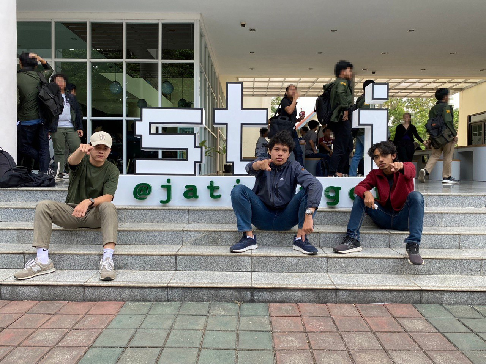

# Tugas Besar 1 IF2123 Aljabar Linear dan Geometri 2023

> "tinky winky dipsy lala puh sepuh, ajarin dong puh"

## Anggota Ajarin Dong Puh Sepuh

|   NIM    |          Nama          |         Hobi         |
| :------: | :--------------------: | :------------------: |
| 13522131 |  Owen Tobias Sinurat   |      Main Bola       |
| 13522141 |  Ahmad Thoriq Saputra  | Mimpi Bisa Main Bola |
| 13522143 | Muhammad Fatihul Irhab |   Ke Kamar Thoriq    |

## Spesifikasi Program

Secara garis besar, program ini merupakan program untuk memanipulasi matriks. Berikut adalah beberapa fiturnya:

1.  Sistem Operasi Linear

    - Mencari solusi dari SPL.
    - Tersedia dalam 4 metode, yaitu metode eliminasi Gauss,
      metode eliminasi Gauss-Jordan,
      metode matriks balikan, dan
      kaidah Cramer.

2.  Determinan
    - Mencari determinan dari sebuah matriks.
    - Tersedia dalam 2 metode, yaitu metode ekspansi kofaktor dan metode reduksi baris.
3.  Matriks Balikan
    - Mencari invers dari sebuah matriks.
    - Tersedia dalam 2 metode, yaitu metode balikan dan metode adjoin.
4.  Interpolasi Polinom
    - Mencari interpolasi polinom dari sebuah matriks.
5.  Interpolasi Bicubic Spline
    - Mencari interpolasi bicubic spline dari sebuah matriks.
6.  Regresi linier berganda
    - Mencari interpolasi linier berganda dari sebuah matriks.

## Cara Menjalankan Program

    1. Buka terminal di folder src, lalu jalankan :

`javac -d ..\bin Matrix/*.java Functions/*.java Main.java`

    2. Buka terminal di folder bin, lalu jalankan :

`java Main`

Pastikan terdapat folder `result` di dalam folder `test` agar hasil perhitungan dapat disimpan!

## Masukan dan Keluaran

    Masukan dan keluaran dapat dilakukan melalui keyboard maupun file.
    Untuk melakukan pengetesan pada program menggunakan file, bisa menaruh file di folder 

`test/case`
    
    Untuk keluaran menjadi sebuah file, akan diletakkan di folder
`test/result`

